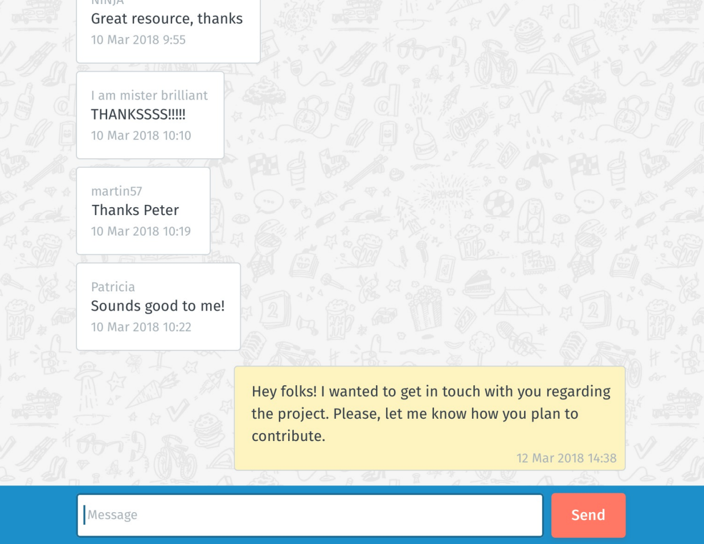

# The challenge (Fullstack Engineer)
We want you to build a simple chat application which is able to send messages and 
display messages from all senders:



We'd like you to create a simple backend with an API for messages that reads and writes data from a database, and a 
frontend to interact with that API.

Your API should have the following features:

```
1. Receive new messages from the client
2. List all messages in chronological order for the client
```

The design of the API is up to you.

Now, when it comes to the frontend, go easy on this one. No perfectly polished CSS is needed. Just present the 
messages as depicted in the wireframe. 

Your solution should be runnable locally using `docker-compose`. Don't forget to include all the dependencies of your 
service in the composer file, including your database system of choice. 

# Rules

We understand your time is precious and would not want you to spend more than **3 to 5 hours** on this over the span 
of **1 week** max. 

Please use a **JVM language**, preferably Java for your backend service. Feel free to use any framework, like Spring 
for example. Now for the frontend, please use JavaScript (Vanilla JS, React, ...). We want you to provide a responsive 
implementation. Keep in mind that Doodle is used worldwide and has to work on commonly used browsers. 

# What we expect
It is OK if the challenge is not completed. Try to **prioritize** it by what you think is more important. Tell us what 
motivated your technology choices, how you tackled the task, what you would do differently were you given more time, 
what you would do differently a second time around, etc.

Here are some pointers for you of things we will be looking for:

* Commit often, write useful commit messages
* Code readability
* Performance: it should load reasonably fast on a mobile device
* Accessibility: the more usable the interface, the better
* Design: we are not looking for pixel-perfect results, but we love attention to detail

# Next steps
Send an email with a link to your repository solution to `code-challenge@doodle.com`.

Make sure your email has the following subject: `FS-<yourname>`. So for example, if your name were "Paul Smith", 
your email subject would be `FS-Paul Smith`

We will review your solution, we strive to get back to you in **48 hours**. Sometimes it might take more.
