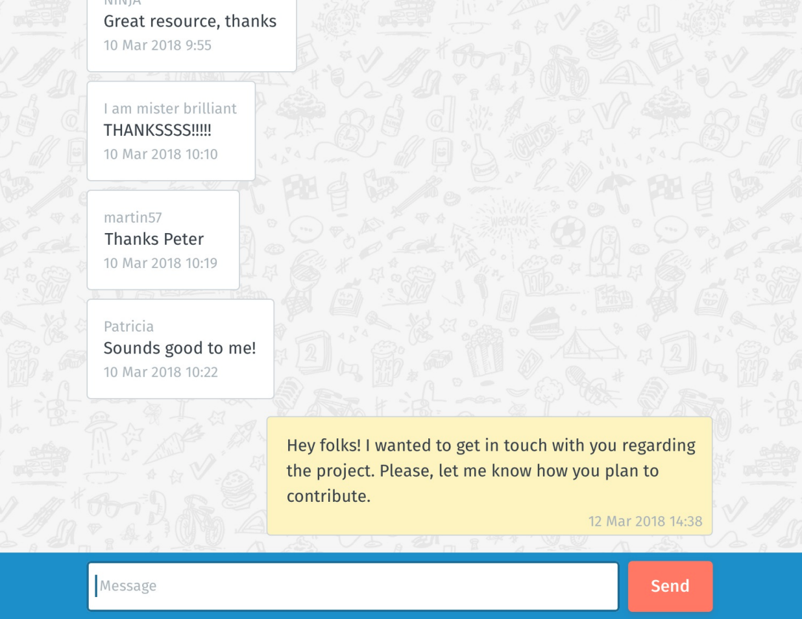

# The challenge (Web Developer)
We would like you to build a simple chat interface in Javascript, which is able to send and display messages from 
all senders. Something like this:



The assets and additional documentation can be found in the **assets** folder.

For this, we have prepared a simple API which receives new messages in a `POST` endpoint
and lists all messages reverse chronological order in a `GET` endpoint:

#### List all messages
```shell script
curl https://chatty.kubernetes.doodle-test.com/api/chatty/v1.0/?token=
[YOUR_AWESOME_UNIQUE_TOKEN]
```
#### List 10 messages before a timestamp
```shell script
curl https://chatty.kubernetes.doodle-test.com/api/chatty/v1.0/?
since=1521096352339&limit=10&token=[YOUR_AWESOME_UNIQUE_TOKEN]

```
#### Send a message
```shell script
curl -X POST \ -H 'Content-Type: application/json' \ -H 'token:
[YOUR_AWESOME_UNIQUE_TOKEN]' \ -d '{"message":"Hello world","author":"Tom"}' \
https://chatty.kubernetes.doodle-test.com/api/chatty/v1.0
```

# Rules
We understand your time is precious and would not want you to spend more than **3 to 5 hours** on this over the span 
of **one week** max. The outcome should be runnable locally on a UNIX-flavored OS (MacOS, Linux) in a common browser.

You must use **JavaScript** (Vanilla JS, React, ...). We want you to provide a responsive
implementation. Keep in mind that Doodle is used worldwide and has to work on commonly
used browsers.

We expect to hear back from you in **one week** from now, latest.

# What we expect
It is OK if the challenge is not completed. Try to **prioritize** it by what you think is more important. Tell us what 
motivated your technology choices, how you tackled the task, what you would do differently were you given more time, 
what you would differently a second time around, etc.

Here are some pointers for you of things we will be looking for:

* Commit often, write useful commit messages
* Code readability
* Performance: it should load reasonably fast on a mobile device
* Accessibility: the more usable the interface, the better
* Design: we are not looking for pixel-pushing, but we love attention to detail

# Next steps

Send an email with a link to your repository solution to `code-challenge@doodle.com`.

Make sure your email has the following subject: `WD-<yourname>`. So for example, if your name were "Paul Smith", 
your email subject would be `WD-Paul Smith`

We will review your solution, we strive to get back to you in **48 hours**. Sometimes it might take more.
